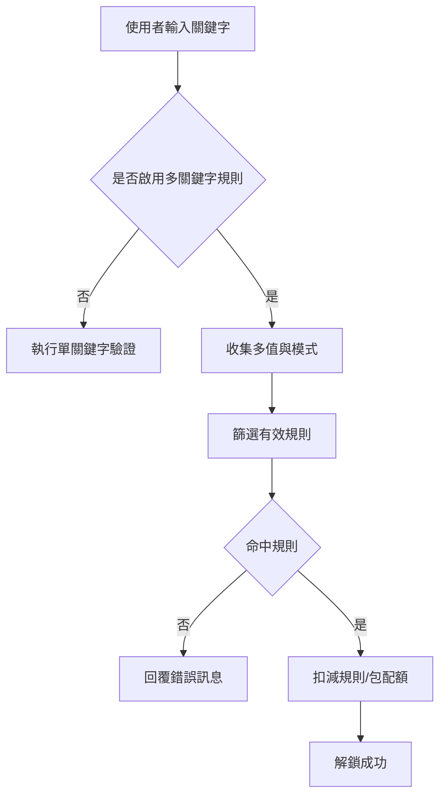

# PRD 1-3: 隱藏作者資訊 + 雙關鍵字以上的特殊資料包設定

## 文檔資訊
- 文檔版本: v1.0
- 建立日期: 2025-10-22
- 規劃範疇: 前台顯示控制 + 進階資料包規則
- 優先級: 高（隱藏作者資訊）、中高（雙關鍵字以上）
- 關聯文件:
  - [Creator.tsx](src/pages/Creator.tsx)
  - [Box.tsx](src/pages/Box.tsx)
  - [TemplateDefault.tsx](src/components/templates/TemplateDefault.tsx)
  - [registry.ts](src/components/templates/registry.ts)
  - [Admin.tsx](src/pages/Admin.tsx)
  - [FeatureCreator.tsx](src/pages/FeatureCreator.tsx)

---

## 一、背景與目標
- 背景：
  - 目前資料包前台頁面會顯示創作者資訊（頭像、名稱、社群連結）。部分創作者希望在特定活動或品牌需求下隱藏這些資訊。
  - 現行關鍵字驗證為單一關鍵字。為支持更高安全性或特別活動，需要支援雙關鍵字或以上的組合規則與特殊資料包配置。
- 目標：
  - 提供「隱藏作者資訊」的簡單可切換控制（checkbox），即時反映於前台。
  - 支援「雙關鍵字或以上」規則，含比對模式、錯誤訊息、配額與有效期等進階條件設定。
- 成功標準：
  - 創作者可於後台勾選後，前台即不顯示作者資訊，且模板版面自動補位，不留空洞。
  - 可建立至少兩組以上的關鍵字規則，正確驗證且可設定各自的配額與有效期（如採規則級或包級策略，見下）。

---

## 二、功能一：隱藏作者資訊（checkbox）

### 2.1 功能敘述
- 為資料包新增布林開關 hideAuthorInfo。開啟時，前台所有模板隱藏作者頭像、名稱、社群連結與創作者專屬區塊；模板應自動調整排版避免空白。
- 此設定為每個資料包獨立控制，預設為關閉（顯示作者）。

### 2.2 UI 設計
- 後台位置：
  - Creator 編輯表單中的「顯示設定」區塊新增一行：
    - 控件：Checkbox「隱藏作者資訊」
    - 副標說明：啟用後，此資料包將不顯示創作者頭像、名稱與社群連結
- 前台行為：
  - [Box.tsx](src/pages/Box.tsx) 載入資料包時，若 hideAuthorInfo = true，則模板側不渲染作者資訊區域（條件渲染）。

### 2.3 行為邏輯
- 互動：
  - 後台勾選/取消 → 立即反映於預覽（若使用 [Creator.tsx](src/pages/Creator.tsx) 左側預覽或內嵌預覽，沿用現有狀態同步機制）。
- 模板渲染：
  - 模板層接收 hideAuthorInfo，若 true：不渲染 AuthorCard/CreatorBadge/社群列；若 false：照常渲染。
  - 若模板有頭部區塊含作者資訊，開關後改以內容區塊置頂補位，或啟用 alternate 樣式 class，避免留白。
- 權限：
  - 所有創作者可使用。與會員等級無關。

### 2.4 邊界與錯誤處理
- 若作者資訊本就缺失（例如未設頭像），且開關關閉，模板應有 graceful fallback；開關打開時則一律不顯示。
- 模板兼容：
  - 需審視 [TemplateDefault.tsx](src/components/templates/TemplateDefault.tsx) 及其他模板，確定有條件渲染與版面補位 class。

### 2.5 資料儲存與結構
- 資料表：packages（假設現行資料包表）
  - 新增欄位：
    - hide_author_info boolean not null default false
- API/型別：
  - 前端型別擴充：Package.hideAuthorInfo: boolean
  - 後端存取保持與現行 CRUD 一致。
- 追蹤與分析（可選）：
  - 可於 client event 加入 view_without_author_info 事件，用於 A/B 觀察。

---

## 三、功能二：雙關鍵字或以上的特殊資料包設定（進階功能）

### 3.1 功能敘述
- 提供資料包層級的「多關鍵字規則」設定，至少支援雙關鍵字組合。
- 可定義多個規則，每個規則包含：
  - 關鍵字清單（2 個或以上）
  - 比對模式（AND 全符合、OR 任一符合、順序要求）
  - 過期時間或生效期間（可選）
  - 規則配額（可選，若與包級配額同時存在，需有衝突解決策略）
  - 自訂錯誤訊息（可選）
- 此為進階功能，可綁定會員分級或權限。

### 3.2 用例與場景
- 雙關鍵字活動：使用者需同時輸入「活動主詞」與「影片內提示詞」才可解鎖。
- 多關鍵字保護：用於高價值資源，需要多重提示收集與驗證。
- 時效型關鍵字：規則於特定時段生效，過期後自動失效。

### 3.3 UI 設計
- 後台 Creator 編輯表單新增「進階規則」區塊：
  - 開關：Switch「啟用多關鍵字規則」
  - 提示：此功能為進階功能。若未升級，顯示升級 CTA。
  - 規則列表（可增刪改）：
    - 規則卡字段：
      - 規則名稱（可選）
      - 關鍵字清單（最少 2 條；提供動態新增/刪除）
      - 比對模式（下拉）：AND 全符合、OR 任一符合、ORDER 順序符合
      - 規則配額（可選，整數）
      - 生效起訖時間（可選）
      - 自訂錯誤訊息（可選）
  - 視覺提示：
    - 不同規則以卡片分隔，顯示狀態標籤：進行中、未開始、已過期、用罄。

- 前台輸入區（[Box.tsx](src/pages/Box.tsx)）：
  - 若啟用多關鍵字規則：
    - 顯示多欄位輸入（至少 2 欄）或單欄多值機制（視 UX 選型）。
    - 若為順序比對，提供輸入序號提示。
    - 失敗時顯示自訂錯誤訊息或預設錯誤訊息。

### 3.4 行為邏輯（驗證流程）
- 驗證入口：
  - 解鎖提交時，依啟用與否切換驗證策略：
    - 未啟用：沿用單關鍵字邏輯。
    - 已啟用：執行規則引擎流程。
- 規則引擎：
  1) 收集使用者輸入的多個關鍵字 values[]
  2) 篩選有效規則（時間窗內、配額未用罄）
  3) 依規則比對模式：
     - AND：規則.keywords 全包含於 values[]
     - OR：規則.keywords 與 values[] 交集非空
     - ORDER：values[] 必須按規則.keywords 順序完全匹配
  4) 命中規則 → 通過驗證；若規則配額有設置，扣減規則配額與包級配額（策略見下）
  5) 未命中 → 回覆錯誤訊息（規則自訂或預設）
- 配額策略（建議）：
  - 包級配額為上限，規則級配額為子限額。驗證成功時：
    - 若規則配額存在：rule.current_count++，同時 package.current_count++；
    - 若規則配額不存在：僅 package.current_count++；
    - 任一達上限則阻擋後續成功驗證。
- 審計與防刷：
  - 記錄驗證嘗試（時間、IP、來源、命中規則 ID 或失敗原因）。
  - 可加入速率限制（前端節流 + 後端 Rate Limit）。

### 3.5 資料儲存與結構
- 方案 A：同表 JSON 欄位（快速上線）
  - packages 表新增：
    - advanced_keyword_rules jsonb null（規則陣列）
    - use_advanced_rules boolean not null default false
  - JSON 結構建議：
    ```
    [
      {
        "id": "rule_id",
        "name": "雙關鍵字活動一",
        "keywords": ["alpha","beta"],
        "matchMode": "AND", // AND|OR|ORDER
        "quota": 100,       // 可省略
        "current": 0,       // 衍生或後端維護
        "startsAt": "2025-10-30T00:00:00Z", // 可省略
        "endsAt": "2025-11-30T23:59:59Z",   // 可省略
        "errorMessage": "兩個提示詞都要正確喔"
      }
    ]
    ```
  - 優點：改動小、快速迭代；缺點：難以跨規則統計查詢。

- 方案 B：規則獨立表（可擴充、易統計）
  - 新增表：package_keyword_rules
    - id uuid pk
    - package_id uuid fk packages.id
    - keywords text[] not null
    - match_mode text not null check in (AND, OR, ORDER)
    - quota int null
    - current_count int not null default 0
    - starts_at timestamptz null
    - ends_at timestamptz null
    - error_message text null
    - status generated/computed（可選）
  - packages 表新增：
    - use_advanced_rules boolean not null default false
  - 建議：長期採用方案 B；短期可先 A，後續遷移。

- 事件與日誌（可選表）：
  - keyword_attempt_logs（審計與風控）

### 3.6 權限與分級
- 此功能為進階功能：
  - 免費版：單關鍵字
  - 標準版或以上：啟用多關鍵字規則，含 AND/OR
  - 專業版：解鎖 ORDER、規則級配額、時間窗、錯誤訊息自訂等
- 前端需根據會員等級控制 UI 開關與 CTA（升級入口）。

### 3.7 體驗細節與邊界
- 輸入體驗：
  - 若為多欄位輸入：應支援 Enter 快速跳下一欄，支援清除與重排。
  - 若為單欄多值：提供 Chip 標籤輸入體驗與序列提示（ORDER 模式）。
- 錯誤提示：
  - 優先使用規則自訂訊息；否則使用預設文案。
- 與現有功能相容：
  - 與候補名單、時效性控制需協同判定；若任一條件不滿足，則阻擋解鎖。

---

## 四、互動流程圖（高層級）



---

## 五、指標與驗收

### 5.1 隱藏作者資訊
- 驗收：
  - 勾選後前台所有模板不顯示作者資訊，版面自動補位，無明顯空白或位移錯亂。
  - 左側預覽或內嵌預覽於 [Creator.tsx](src/pages/Creator.tsx) 可即時反映。
- 指標：
  - 模板一致性：100%
  - 啟閉切換渲染回應 < 100ms（P95）

### 5.2 多關鍵字規則
- 驗收：
  - AND、OR、ORDER 三模式依規則正確驗證。
  - 可設定至少 2 條規則，時間窗與規則配額生效。
  - 與包級配額協同正確扣減，不出現超發。
- 指標：
  - 驗證準確率 100%（測試樣例）
  - 回應時間 < 200ms（P95，前端）

---

## 六、風險與緩解
- 版面兼容風險（隱藏作者資訊）：先覆核所有模板分支，提供通用 Author 區段佔位 class，必要時在 [registry.ts](src/components/templates/registry.ts) 層面統一注入條件。
- 規則複雜度提升：先以 AND/OR 上線，ORDER 作為第二階段；提供可觀測性（事件、日誌）。
- 配額一致性：後端需使用原子操作或安全更新，避免並發超發。

---

## 七、開發與發布建議（分階段）
- Phase 1（當週）
  - 隱藏作者資訊：後台 checkbox、模板條件渲染、預覽同步
  - 多關鍵字規則：UI 草稿 + AND/OR 驗證、JSON 方案 A 暫存
- Phase 2（次週）
  - ORDER 模式、規則配額、生效時間窗
  - 後端日誌與速率限制
- Phase 3
  - 方案 B 正規化資料表 + 遷移工具
  - 分級權限與升級 CTA 完整化

---

## 八、相關檔案與觸點
- 後台頁面：[Creator.tsx](src/pages/Creator.tsx)
- 前台頁面：[Box.tsx](src/pages/Box.tsx)
- 模板註冊與渲染：
  - [registry.ts](src/components/templates/registry.ts)
  - [TemplateDefault.tsx](src/components/templates/TemplateDefault.tsx)
- 管理頁（可視需要）：[Admin.tsx](src/pages/Admin.tsx)

---

## 附錄A：測試計劃

### A.1 測試範圍
- 功能一：隱藏作者資訊（hideAuthorInfo）
  - 後台開關操作與即時預覽 [Creator.tsx](src/pages/Creator.tsx)
  - 前台渲染與版面補位 [Box.tsx](src/pages/Box.tsx) + 模板層 [TemplateDefault.tsx](src/components/templates/TemplateDefault.tsx) 與其他模板
- 功能二：多關鍵字規則（AND/OR/ORDER）
  - 後台規則設定 UI 與資料存取
  - 前台輸入驗證流程與錯誤訊息顯示
  - 配額與時間窗策略（方案 A JSON 儲存）

### A.2 測試類型與要點
- 單元測試（Unit）
  - 隱藏作者資訊
    - 模板條件渲染：when hideAuthorInfo=true，不渲染作者區塊；為 false 正常渲染
    - 版面補位：alternate 樣式 class 是否依條件套用
    - 範例檔案：優先覆蓋 [TemplateDefault.tsx](src/components/templates/TemplateDefault.tsx)、[registry.ts](src/components/templates/registry.ts)
  - 規則驗證引擎
    - AND：keywords 全包含於 values
    - OR：交集非空
    - ORDER：完全順序符合
    - 配額扣減策略：規則級 current 與包級 current 同步增量
    - 時間窗判定：now 在 [startsAt, endsAt] 內才有效
    - 錯誤訊息優先級：規則自訂 > 預設
    - 範例檔案：驗證邏輯所在之 util/hook 或頁面邏輯（依實作路徑補足）

- 整合測試（Integration）
  - 後台到前台資料流
    - 在 [Creator.tsx](src/pages/Creator.tsx) 勾選隱藏作者資訊 → 儲存 → [Box.tsx](src/pages/Box.tsx) 讀取後隱藏
    - 建立多關鍵字規則（2 條以上，含不同 matchMode）→ 前台依規則驗證
  - 配額一致性
    - 連續成功驗證 N 次，規則級與包級配額同步遞增並在上限阻擋
  - 異常與邊界
    - 作者資訊缺失時的 graceful fallback
    - 規則過期、未開始、已用罄狀態的 UI 呈現與驗證阻擋
  - 資料儲存
    - 方案 A：advanced_keyword_rules 與 use_advanced_rules 欄位讀寫一致

- 使用者驗收測試（UAT）
  - 隱藏作者資訊
    - 勾選開關後，所有模板看不到作者頭像/名稱/社群列，版面無明顯空洞；切回顯示正常
    - 預覽面板即時反映
  - 多關鍵字規則
    - AND：輸入任一關鍵字不足時應失敗，兩者皆正確才通過
    - OR：任一正確即通過
    - ORDER：順序錯誤應失敗，順序正確才通過
    - 規則時間窗：非生效期內一律失敗並提示
    - 規則配額：達上限後新的成功應被阻擋
    - 自訂錯誤訊息：顯示規則自訂文案
  - 體驗
    - 多欄位輸入或單欄多值（依實作）：Enter 跳欄、清除、序列提示是否生效
    - 失敗提示清楚不洩漏正確答案

### A.3 測試資料與樣例
- 規則樣例（方案 A JSON）
  - 規則 R1：AND["alpha","beta"], quota=2, 有效期內, errorMessage="兩個提示詞都要正確喔"
  - 規則 R2：OR["cat","dog"], quota=null, 有效期外
  - 規則 R3：ORDER["x","y","z"], quota=1, 有效期內
- 使用者輸入組合
  - ["alpha"] → AND 失敗
  - ["alpha","beta"] → AND 成功並扣配額
  - ["dog"] → R2 若過期則失敗
  - ["x","z","y"] → ORDER 失敗；["x","y","z"] → 成功

### A.4 進出場條件
- 測試進場：功能開發完成、單元測試通過率 ≥ 90%、主要流程已可跑通
- 測試退出：所有高/中優先級缺陷已關閉，UAT 驗收項目全部通過

---

## 附錄B：開發 TODO 列表（任務分解）

- 資料結構與型別
  - packages 表新增 hide_author_info boolean default false
  - packages 表新增 use_advanced_rules boolean default false
  - packages 表新增 advanced_keyword_rules jsonb（方案 A）
  - 前端型別擴充 Package.hideAuthorInfo 與規則型別
- 後台 UI 與邏輯 [Creator.tsx](src/pages/Creator.tsx)
  - 顯示設定區塊加入 Checkbox「隱藏作者資訊」
  - 進階規則區塊：開關 + 規則卡 CRUD + 欄位（名稱、keywords、matchMode、quota、時間窗、錯誤訊息）
  - 儲存/讀取與預覽同步
- 前台頁與模板
  - [Box.tsx](src/pages/Box.tsx) 讀取 hideAuthorInfo 與規則設定，根據 use_advanced_rules 切換驗證流程與輸入 UI
  - 模板層條件渲染作者區塊 + 版面補位（至少 [TemplateDefault.tsx](src/components/templates/TemplateDefault.tsx)）
  - 如有共用注入點，於 [registry.ts](src/components/templates/registry.ts) 統一處理
- 規則驗證引擎
  - AND/OR/ORDER 模式比對
  - 配額扣減策略（規則級/包級）
  - 時間窗有效性判斷與狀態標籤
  - 錯誤訊息優先級
- 事件與防刷（可選）
  - 嘗試與結果事件紀錄、前端節流
- 測試
  - 單元：模板條件渲染、驗證引擎、配額/時間窗
  - 整合：後台→前台資料流、規則 CRUD→驗證、異常邊界
  - UAT：照 A.2 列表逐項驗收
- 發布與回滾
  - Phase 1：隱藏作者資訊 + AND/OR + JSON 方案
  - Phase 2：ORDER + 規則配額/時間窗強化 + 日誌/速率限制
  - Phase 3：正規化資料表與遷移工具

---

## 九、變更記錄
- v1.0 2025-10-22：初版定義隱藏作者資訊與多關鍵字規則之 PRD

---

## 附錄C：UI 簡化改進（2025-10-22）

### 變更原因
用戶反饋 JSON 編輯器過於複雜且不直觀，建立規則成本高。

### 新 UI 設計（簡化後）
- 關鍵字輸入：Textarea，逗號分隔多關鍵字
- 僅支援 OR 模式（任一符合即解鎖），不提供模式選擇
- 不提供自訂錯誤訊息欄位
- 僅支援單一規則組合（依需求確認）

### 向後相容策略
- 讀取：若既有 unlock_rule_json 為陣列，取第一筆轉為簡化 UI 顯示
- 儲存：簡化 UI 轉換為標準 JSON 陣列格式存回；仍同步 unlock_rules 表
- 進階欄位 quota、startAt、endAt 維持隱藏（保留擴充空間）

### 前端變更
- Creator.tsx 新增/編輯面板：
  - 以 Textarea+Select+Input 取代 JSON Textarea
  - 新增狀態：newUnlockKeywords/mode/error 與 editUnlockKeywords/mode/error
  - handleAddKeyword/handleUpdateKeyword：由簡化欄位組裝單一 JSON 規則
  - handleEdit：自 JSON 或 unlock_rules 第一筆回填簡化欄位
- 會員限制：仍為付費功能

### 驗收（簡化後）
- 僅支援 OR 模式：任一關鍵字符合即通過
- 允許只輸入 1 個關鍵字即可建立與驗證
- 不顯示自訂錯誤訊息欄位；UI 僅保留關鍵字 Textarea
- 舊資料轉換顯示正確；新資料可正常建立與更新